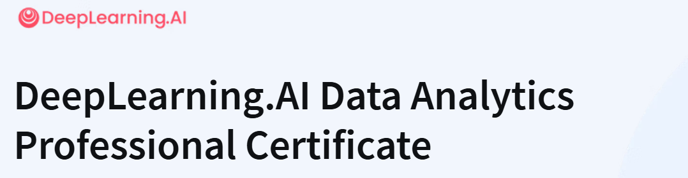

# DeepLearning.AI Data Analytics Professional Certificate

Develop a Robust Foundation in Data Analytics. Build a job-ready data analytics skillset using industry-standard tools, including generative AI, to extract insights, make decisions, and solve real-world business problems

`What we will learn`

Statistics for real-world decision-making. Learn to calculate and interpret descriptive and inferential statistics to solve business problems.   

Data visualization and storytelling. Create compelling visualizations that effectively communicate complex data stories to stakeholders. 

Generative AI for analytics. Leverage genAI in the data analytics lifecycle, with hands-on labs and guidance on when and how to use AI assistance.